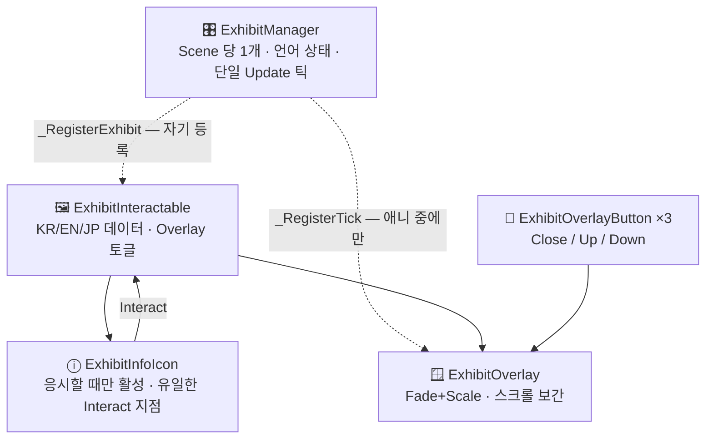

<div align="center">

# 🖼️ Exhibit Descriptor

**작품을 응시하면 ⓘ 아이콘이 뜨고, 누르면 설명이 그 자리에서 펼쳐지는 VRChat 전시 시스템.**

아이콘 위치도, 판넬 방향도, 벽과의 간격도 런타임이 정합니다. 작품마다 손으로 맞출 값이 없습니다.

[](https://rwe.kr/ExhibitDescriptor/)
[](https://github.com/gwanryo/ExhibitDescriptor/releases)
[](LICENSE)


</div>

---

## ✨ 무엇을 하나

```
        감상 중                      응시                        클릭
   ┌──────────────┐          ┌──────────────┐          ┌──────────────────────────┐
   │              │          │           ⓘ  │          │  ┌────────────────┐ ┌─┐ │
   │     작품     │   ──▶    │     작품     │   ──▶    │  │ 제목           │ │×│ │
   │              │          │              │          │  │ 설명 본문...   │ │▲│ │
   └──────────────┘          └──────────────┘          │  └────────────────┘ │▼│ │
     판정 영역 없음             아이콘만 켜짐             아이콘 자리에서 펼쳐짐
                                                          (버튼은 본문 밖 열)
```

**VR 이라면 가운데 단계를 건너뛸 수 있습니다.** `Open Mode` 를 `Proximity` 로 두면 아이콘 없이
**응시한 채 다가가는 것만으로** 설명이 펼쳐지고, 시선이나 거리를 벗어나면 저절로 접힙니다.
14cm 짜리 아이콘을 손 레이로 겨눌 일이 사라집니다. 기본값은 `Icon` 이라 기존 월드는 그대로입니다.

|  | |
|---|---|
| 🎯 **감상을 방해하지 않음** | 작품 정면에 Interact 판정이 없습니다. 툴팁도 하이라이트도 뜨지 않습니다 |
| 🥽 **VR 에서 조준이 필요 없음** | `Proximity` 모드는 응시한 채 다가가면 저절로 열립니다. 본문은 오른손 스틱으로 스크롤 |
| 🧭 **배치 자동 결정** | 아이콘·판넬의 좌우 부호와 글자 방향을 매 프레임 플레이어 머리 위치로 계산 |
| 🧱 **벽에 잠기지 않음** | 앞뒤로 Raycast 해 빈 구간을 재고, 기울어진 만큼만 관람자 쪽으로 빼냄 |
| 🌏 **KR / EN / JP** | 비워 둔 언어는 KR 로 자동 fallback. 전환 버튼 라벨은 항상 동기화 |
| 🪟 **다중 Overlay** | 여러 작품 설명을 동시에 띄워 비교 가능. 전부 Local Only |
| ⚡ **100개+ 확장** | Update 는 Manager 하나뿐. 유휴 상태 연산 0 |
| 🛠️ **에디터 자동화** | 선택한 Mesh 100개를 한 번에 작품으로 변환, 저장할 때 참조 자동 연결 |

---

## 📦 설치

### VCC (권장)

1. **[저장소 추가 페이지](https://rwe.kr/ExhibitDescriptor/)** 에서 *Add to VCC* 를 누릅니다
   <sub>수동 입력: `Settings > Packages > Add Repository` → `https://rwe.kr/ExhibitDescriptor/index.json`</sub>
2. World 프로젝트의 `Manage Project` 에서 **Exhibit Descriptor** 를 `+`

### 수동

[Releases](https://github.com/gwanryo/ExhibitDescriptor/releases) 의 zip 을 `Packages/com.gwanryo.exhibit-descriptor/` 에 풀어 넣습니다.

> [!WARNING]
> `Assets/` 아래로 복사하지 마세요. `Packages/` 설치본과 GUID 가 겹칩니다.

**요구사항** — Unity 2022.3 · VRChat Worlds SDK 3.10.4+ · UdonSharp · ClientSim(테스트용)

---

## ⚡ 60초 시작

```
Tools > Exhibit Descriptor > Create > Exhibition Root
Tools > Exhibit Descriptor > Create > Exhibit (Template)
```

```
ExhibitionRoot
├─ ExhibitManager      ← Scene 당 1개. 언어 상태만 관리
└─ Exhibit_New         ← 작품 1개. Title / Description 만 채우면 끝
   └─ Artwork          ← 여기에 작품 Mesh
```

Overlay·버튼·Collider·참조 연결은 전부 자동으로 만들어져 있습니다. `ExhibitInteractable` 의 `Title KR` / `Description KR` 만 채우고 Play 하세요.

> [!TIP]
> 이미 Scene 에 작품 Mesh 를 배치해 뒀다면 전부 선택하고
> **`Create > Exhibits From Selected Meshes`** — 100개도 한 번에 작품이 됩니다.

👉 처음이라면 **[QUICKSTART.md](QUICKSTART.md)** 가 10분짜리 안내입니다. 이 문서는 레퍼런스입니다.

---

## 🧠 어떻게 동작하나



#### 배치의 부호는 에디터가 추측하지 않습니다

에디터가 굽는 값은 **기하 세 개**(중심 · extents · 가장 얇은 축)뿐입니다. 앞/뒤 부호는 런타임이 정합니다.

```
side = sign( dot(head - artworkCenter, thinAxisWorld) )
```

그래서 작품을 옮기거나 Mesh 를 교체·스케일해도 아이콘과 판넬이 따라옵니다. 작품 앞뒤 어느 쪽에서 봐도 글자가 정방향으로 읽힙니다.

#### 설계 원칙

- **데이터는 작품이, 정책은 Manager 가** — 작품을 추가할 때 Manager 를 건드릴 일이 없습니다
- **Update 는 한 곳** — Overlay 는 애니메이션이 필요한 순간에만 틱에 등록되고, 끝나면 스스로 빠집니다. 작품 100개 × 유휴 = 연산 0
- **자기 등록** — `OnEnable` 에서 스스로 등록. Inspector 에 100개를 끌어다 놓지 않습니다
- **비활성에는 호출하지 않는다** — 상태 조회는 `public bool IsOpen` 필드 읽기로, 정리는 각자의 `OnDisable` 에서

---

## 🛠️ 에디터 도구

### Exhibit Descriptor 창

```
Tools > Exhibit Descriptor > Exhibit Descriptor
```

**평소에는 이 창만 쓰면 됩니다.** 설정·만들기·점검이 위에서 아래로 한 화면에 있습니다.

| 구역 | 하는 일 |
|---|---|
| **① 전시 준비** | Scene 마다 한 블록. `Overlay 폰트` · `벽 판정 Layer` · `기본 언어` · `열림 방식` |
| **② 작품** | 선택한 Mesh 를 작품으로 · 빈 작품 1개 · Setup(선택/씬 전체) · `저장할 때 자동 Setup` 체크 |
| **③ 점검** | `검사` 를 누르면 오류·경고를 **같은 문제끼리 접어서** 보여 줍니다. 줄의 `선택` 을 누르면 그 오브젝트가 Hierarchy 에서 잡힙니다 |

창이 하는 일 중 메뉴가 못 하는 것이 둘 있습니다.

- **폰트·레이어를 고치면 그 자리에서 반영합니다.** 이 두 값은 Setup 이 굽기 전에는 아무 효과가
  없습니다. 값만 넣고 Setup 을 잊어 한글이 계속 □ 로 보이는 것이 가장 흔한 사고였는데, 창에서
  고치면 바로 구워지고 `작품 47개에 반영했습니다` 처럼 결과가 한 줄로 남습니다.
- **작품 100개가 같은 문제를 가지면 한 줄로 접힙니다.** 콘솔은 100줄을 쏟아 내 나머지 문제를
  스크롤 밖으로 밀어냅니다.

> 세부 값(아이콘 크기·시선 각도·페이드·스캔 수)은 창에 없습니다. `ExhibitManager` Inspector 에
> 그대로 있고, 창의 `ExhibitManager 선택` 버튼이 거기로 데려다줍니다. 값의 **원본은 언제나
> Scene 의 컴포넌트**입니다 — 창은 그것을 그려 주기만 하므로 Inspector 와 어긋나지 않고
> `Ctrl+Z` 도 그대로 됩니다.

### 메뉴

| 메뉴 | 하는 일 |
|---|---|
| `Create > Exhibition Root` | Root + Manager 생성 (활성 Scene 기준 중복 검사) |
| `Create > Exhibit (Template)` | 작품 1개 전체 생성 + 자동 연결 (선택한 오브젝트를 부모로) |
| **`Create > Exhibits From Selected Meshes`** | 선택한 Mesh 를 **일괄** 작품화. World 위치 유지, 이름 보존 |
| `Setup > Selected Exhibits` | 참조 자동 연결 + Interact 값 베이크 (부모 하나만 골라도 자식 전체) |
| `Setup > All Exhibits In Scene` | 열린 모든 Scene 일괄 (연결은 각자의 Scene 안에서만) |
| **`Setup > Auto Setup On Save`** | Scene 저장 시 자동 Setup — **기본 ON**. 평소엔 Setup 을 누를 일이 없습니다 |
| `Validate Scene` | 창의 ③ 점검과 같은 검사를 **콘솔에** 보고 (배치 스크립트·CI 용) |

`Validate Scene` 과 창의 `검사` 는 같은 함수를 씁니다. 찾는 것은 한 곳에서 하고 보여주는 곳만
둘이라, 창과 콘솔의 결과가 갈라지지 않습니다.

<details>
<summary><b>일괄 변환이 자동으로 계산하는 것</b></summary>

| 항목 | 계산 방식 |
|---|---|
| 이름 | `Exhibit_001`, `Exhibit_002` … Scene 의 마지막 번호 다음부터 |
| 기하 | Bounds 중심 / extents / 가장 얇은 축 — 전부 작품 로컬 좌표, Setup 마다 덮어씀 |
| 아이콘 크기 | `iconSize`(0.08m) → 아이콘 Scale. Collider 는 조준 편의로 `max(size×1.75, 0.14m)` |
| 아이콘 위치·방향 | **굽지 않음.** 런타임이 매 프레임 계산 |
| 벽과의 거리 | 런타임 Raycast. 손댈 값 없음 |
| `Title KR` | 원본 오브젝트 이름 (EN/JP 는 비워 KR fallback) |

- Bounds 는 World AABB 8꼭짓점을 Root 로컬로 변환해 다시 계산 → 회전된 작품에서도 어긋나지 않음
- 얇은 축을 정면 법선으로 보고, 판넬은 **정면과 수직인 수평축**으로 밀어냄 → 액자를 가리지도, 선으로 보이지도 않음
- 바닥에 눕힌 판(얇은 축이 Y)은 넓은 수평축으로 밀어내고 판넬을 세움
- 낮은 좌대는 판넬 높이를 `bounds.min.y + 판넬 절반높이` 로 올려 바닥에 묻히지 않게 함
- 건너뛰는 것: Renderer 없음 · 이미 Exhibit 안 · 선택 목록 내 다른 오브젝트의 자식 → 이유를 콘솔에 남김

</details>

<details>
<summary><b>수동 Setup 이 정말 필요한 순간</b> (Auto Setup 을 껐다면)</summary>

| 상황 | 이유 |
|---|---|
| `Interaction Proximity` / `Interaction Text` 변경 | 이 둘만 UdonBehaviour 직렬화 필드에 **굽는** 값 |
| Prefab 인스턴스를 새로 배치 | `manager` 는 Scene 참조라 Prefab Asset 에 저장되지 않음 |

**Title / Description 만 바꿨다면 Setup 은 필요 없습니다.** 런타임에 필드에서 바로 읽습니다.

</details>

<details>
<summary><b>Additive Scene 규칙</b></summary>

- Manager 는 "Scene 당 1개". 검색·생성·연결·검증이 전부 Scene 단위입니다
- 같은 Scene 에 Manager 가 없으면 **다른 Scene 것을 대신 연결하지 않고** 누락으로 보고합니다 (교차 Scene 참조는 언로드 순간 깨집니다)
- 오브젝트를 다른 Scene 으로 옮겨 `manager` 가 옛 Scene 을 가리키면, Setup 이 같은 Scene 의 Manager 로 교체하거나 비우면서 경고합니다
- `Validate Scene` 은 Scene 별로 세므로, 3개 Scene 에 1개씩 둔 구성은 통과합니다

</details>

---

## ⚙️ 설정

<details>
<summary><b>ExhibitManager — 전시 전체 기본값</b></summary>

| 필드 | 기본값 | 설명 |
|---|---|---|
| `Default Language` | `KR` | 시작 언어 |
| `Default Open Mode` | `Icon` | `Icon` = ⓘ 를 Interact / `Proximity` = 응시+거리로 자동 |
| `Proximity Open Delay` | `0.5` s | 이만큼 계속 응시해야 열림. 0 이면 즉시 |
| `Proximity Close Cooldown` | `0.3` s | 저절로 닫힌 뒤 이 시간 동안은 다시 안 열림 |
| `Proximity Exit Range Scale` | `1.25` | 닫힘 거리 = `Gaze Distance` × 이 값 |
| `Stick Scroll Speed` | `600` px/s | VR 오른손 스틱 스크롤 속도. 0 이면 끔 |
| `Stick Scroll Deadzone` | `0.2` | 이보다 작은 스틱 입력은 무시 |
| `Stick Scroll Invert` | `false` | 스틱 상하 방향이 반대로 느껴지면 켜기 |
| `Default Interaction Text` | `설명` / `Description` / `説明` | 작품이 비워 두면 이 값 |
| `Default Proximity` | `2` m | Interact 가능 거리 (`Icon` 모드에서만 쓰임) |
| `Default Icon Placement` | `Right` | 관람자 기준 Right / Left / Above / Below |
| `Default Icon Gap` | `0.15` m | 작품 가장자리와 아이콘 사이 |
| `Default Icon Size` | `0.08` m | 아이콘 한 변 |
| `Default Gaze Distance` | `6` m | 이 밖에서는 아이콘이 뜨지 않음 |
| `Gaze Enter / Exit Angle` | `25°` / `45°` | 히스테리시스 — 아이콘을 조준하려 고개를 돌려도 사라지지 않게 |
| `Icon Fade Duration` | `0.12` s | |
| `Icon Scan Per Frame` | `8` | 작품 100개면 한 바퀴 약 13프레임(0.2초) |
| `Icon Clearance` | `0.02` m | 벽·작품 표면에서 확보할 최소 간격 |
| `Debug Log` | `false` | 등록/전환 로그. 완성 후엔 꺼두세요 |

</details>

<details>
<summary><b>ExhibitInteractable — 작품 단위</b></summary>

**내용** — `Title` / `Subtitle`(작가·연도) / `Description` 을 KR·EN·JP 로. **비우면 KR 로 fallback.**
추가 정보는 `Extra Labels` / `Extra Values` 를 같은 순서로 채웁니다 (재료, 크기, 소장처 …).

**표시 토글** — `Show Title` / `Subtitle` / `Description` / `Extra Info`

**개별 오버라이드** — `Icon Placement` 를 `Default` 가 아닌 값으로 두면 그 작품만 다른 쪽에 붙습니다.
`Open Mode` 도 같은 규칙이라 작품 하나만 근접 자동으로 둘 수 있습니다.
`Override Icon Settings` 를 켜면 gap · height offset · size · gaze distance 를 작품 단위로 잡습니다.

> [!IMPORTANT]
> **작품 Mesh 에는 Collider 를 붙이지 마세요.** 클릭 판정은 아이콘이 전담합니다.
> 작품에 Collider 가 있으면 Interact 레이가 거기서 막혀 아이콘이 눌리지 않습니다. (Validate 가 경고합니다)

</details>

<details>
<summary><b>🈶 CJK 폰트 — 한글이 □ 로 보인다면 여기</b></summary>

TMP 기본 폰트(`LiberationSans SDF`)에는 한글·일본어 글리프가 없습니다.

1. `Noto Sans CJK KR` 또는 `Source Han Sans`(OFL) 를 `Assets/Fonts` 에 넣습니다
2. `Window > TextMeshPro > Font Asset Creator`
   - Sampling Point Size `Auto Sizing` · Padding `5` · Atlas `4096×4096` · Render Mode `SDFAA`
   - Character Set `Unicode Range (Hex)`:
     ```
     20-7E,A1-FF,3000-303F,3040-309F,30A0-30FF,4E00-9FFF,AC00-D7A3,FF00-FFEF
     ```
     <sub>ASCII + 일본어 かな + CJK 통합한자 + 한글 완성형 + 전각기호</sub>
3. **Generate Font Atlas → Save as** `NotoSansCJK SDF`
4. **Exhibit Descriptor 창의 `① 전시 준비 > Overlay 폰트`** 에 지정 (또는 `ExhibitManager` 의 `Exhibit Descriptor Settings > Overlay Font` 슬롯)
5. 창에서 지정했다면 **이미 반영되어 있습니다.** Inspector 에서 직접 넣었다면 `Setup > All Exhibits In Scene` 을 한 번 실행하세요

**폰트를 동봉하지 않는 이유** — CJK 폰트는 재배포 조건이 제각각입니다. 패키지가 폰트를 품으면 이 패키지를 쓰는 월드까지 그 라이선스를 지게 되므로, 선택은 프로젝트에 맡기고 슬롯만 제공합니다.

**폰트 슬롯이 Manager 가 아닌 이유** — `TMP_FontAsset` 은 Udon 타입 화이트리스트에 없어 U# 직렬화 필드로 둘 수 없습니다. Editor 전용 `MonoBehaviour`(`ExhibitDescriptorSettings`) 로 분리했습니다.

</details>

---

## 🎚️ 열림 방식

**`Tools > Exhibit Descriptor` 창의 `① 전시 준비 > 열림 방식`** 에서 전시 전체를 한 번에 정합니다.
작품마다 다르게 두려면 `ExhibitInteractable` 의 `Open Mode` 를 `Default` 가 아닌 값으로 바꾸세요.

| | `Icon` (기본) | `Proximity` |
|---|---|---|
| 여는 법 | ⓘ 아이콘을 Interact | 응시한 채 `Gaze Distance` 안으로 들어가면 자동 |
| 닫는 법 | `×` 버튼 | 시선/거리를 벗어나면 자동 (`×` 도 그대로 동작) |
| ⓘ 아이콘 | 응시하면 뜸 | **한 번도 뜨지 않음** (Collider 도 없음) |
| 동시 열림 | 여러 개 가능 | 하나만 — 먼저 응시한 쪽이 유지됨 |
| VR 조준 | 필요 | 불필요 |

#### 다가가서 읽어도 닫히지 않습니다

Panel 은 작품 옆에 서므로, 가까이서 읽으면 작품 중심은 시야에서 크게 벗어납니다. 폭 2m 짜리
그림을 1m 거리에서 읽으면 작품 중심은 **56°** 로 밀려나 `Gaze Exit Angle`(45°) 밖입니다.

그래서 **여는 판정과 유지하는 판정의 대상이 다릅니다.** 열 때는 작품 중심을 보고, 유지할 때는
**Panel 을 봅니다.** Panel 은 점이 아니라 크기를 가진 대상으로 재기 때문에 가까이 갈수록 판정이
저절로 넓어집니다 (1.5m 에서 15.5°, 1.0m 에서 22.5°). 맞출 값은 없습니다.

#### `×` 는 "그만 볼래" 라는 뜻이 됩니다

근접 모드에서 `×` 로 닫으면, **시선이 그 작품을 한 번 벗어나기 전까지** 다시 열리지 않습니다.
그냥 닫기만 하면 여전히 보고 있으므로 곧바로 다시 열릴 텐데, 그게 아니라 잠깁니다.

#### VR 스크롤

VR 이면 **오른손 스틱 상하**로 응시 중인 Panel 의 본문이 스크롤됩니다. VRChat VR 에서 이 축이
비어 있어 쓸 수 있습니다. Desktop 은 같은 축이 마우스 시점이라 동작하지 않고, `▲/▼` 버튼을
그대로 씁니다. 이 기능은 열림 방식과 무관하게 VR 이면 항상 켜집니다.

---

## 🌐 언어 전환

**월드 버튼** — `ExhibitLanguageSwitch` 를 붙인 오브젝트(Collider 필요)를 배치.
`Cycle Language = true` 면 버튼 하나로 KR→EN→JP 순환, `false` + `Target Language` 면 언어별 버튼 3개.

**다른 Udon 에서**

```csharp
manager._SetLanguage(ExhibitLanguage.EN);
manager._SetLanguageIndex(1);
manager._CycleLanguage();
```

`SendCustomEvent` 로도 됩니다 — `_SetLanguageKR` / `_SetLanguageEN` / `_SetLanguageJP`.

전환하면 활성 작품 전체가 Interact 문구를 갱신하고, **열려 있는 Overlay 만** 다시 씁니다. 닫힌 Overlay 는 다음에 열릴 때 새 언어로 채워집니다. 전환 버튼이 여러 개여도 라벨은 Manager 브로드캐스트로 항상 같은 값을 가리킵니다.

---

## 🩺 트러블슈팅

| 증상 | 원인 / 해결 |
|---|---|
| 작품을 봐도 아무것도 안 뜬다 | **정상입니다.** 정면에는 판정이 없습니다 — 옆의 ⓘ 를 보세요 |
| 아이콘 자체가 안 뜬다 | Setup 미실행(기하 미베이크) · 6m 밖 · Layer 가 `Default` 가 아님 → `Validate Scene` |
| 한글/일본어가 □ | CJK 폰트 미지정 → 위 폰트 섹션 |
| 버튼이 안 눌린다 | 버튼 Layer 가 `UI` → **`Default`** 로 |
| 입장하자마자 Overlay 가 다 켜져 있다 | `Overlay` 오브젝트가 활성 상태로 저장됨 → 체크 해제 |
| 아이콘이 벽에 파묻힌다 | 벽감이 너무 좁음 → `Icon Placement` 를 반대쪽/`Above` 로 (Validate 가 미리 경고) |
| VR 에서 ⓘ 를 못 누르겠다 | 열림 방식을 **`Proximity`** 로 — 아이콘 없이 다가가면 열립니다 |
| 근접 모드인데 아이콘이 안 뜬다 | **정상입니다.** 그 모드는 아이콘을 쓰지 않습니다 |
| 근접 모드에서 옆 작품이 자꾸 열린다 | `Gaze Distance` 가 작품 간격보다 큼 → 줄이세요 (Validate 가 경고) |
| 근접 모드에서 걸어 다니면 판넬이 깜빡인다 | `Proximity Open Delay` 를 올리세요 (기본 0.5초) |
| VR 스틱으로 스크롤이 안 된다 | Desktop 에서는 동작하지 않습니다 · `Stick Scroll Speed` 가 0 인지 확인 |
| Tools 메뉴가 없다 | UdonSharp 컴파일 에러 → Console 확인 |
| Prefab 복제 후 Manager 참조가 비어 있음 | 정상 — Scene 참조는 Prefab 에 저장 안 됨. Setup 실행 |
| 빌드 시 Udon serialization 에러 | `VRChat SDK > Utilities > Reserialize All Udon Assets` |
| 저장할 때 `CopyProxyToUdon` NullReferenceException | U# 프로그램 미컴파일 → `VRChat SDK > Udon Sharp > Compile All UdonSharp Programs`. 2.2.1 부터는 이 상태에서도 나머지 작품 Setup 은 끝까지 돌고, 콘솔에 원인을 남깁니다 |
| `Multiple EventSystems in scene` | Scene 의 EventSystem 삭제 (VRChat 이 자체 제공) |

무슨 일이 나든 먼저 **`Tools > Exhibit Descriptor > Exhibit Descriptor`** 창을 열고 **③ 점검**의 `검사` 를 누르세요. 같은 문제끼리 묶어 보여 주고, 줄의 `선택` 이 범인 오브젝트로 데려다줍니다. (콘솔로 받고 싶으면 `Validate Scene`)

---

## 📈 100개 이상으로

| 항목 | 처리 |
|---|---|
| Update | Manager 하나뿐. 애니메이션 중인 Overlay 가 0개면 즉시 return |
| 렌더링 | 닫힌 Overlay 는 `SetActive(false)` → 드로우콜·Canvas 리빌드 0 |
| Canvas | Overlay 마다 독립 → 한 곳의 갱신이 다른 Overlay 를 리빌드시키지 않음 |
| `Find` / `GetComponent` | 런타임 호출 0회 (Setup 이 전부 연결) |
| 폰트 | Font Asset 1개 공유 → 아틀라스 1장 |

`ExhibitionRoot/Room_1F`, `Room_2F` 처럼 층·전시실 단위로 묶고 멀리 있는 구역은 통째로 비활성화하세요. Static Batching 은 작품 Mesh 에만.

---

## 📄 라이선스

[MIT](LICENSE) © [Ryo](https://github.com/gwanryo)
